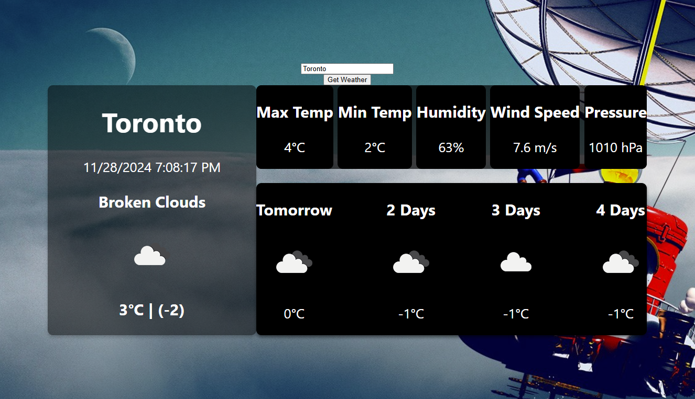

# Documentation

Simply type your city name into the box and click the Get Weather button

Your current weather is displayed on the left side
Extra pieces of information are displayed on the right in the top bar including
- Maximum Temperature
- Minimum Temperature
- Humidity
- Wind Speed
- Pressure
Below that you can find a forecast for the next 4 days of the week

